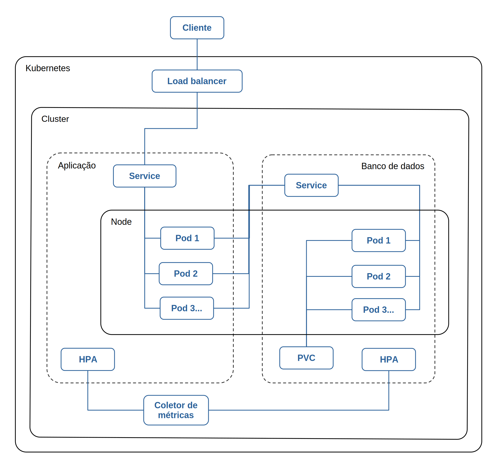

  # Tech Challenge - Fase 2

  Projeto realizado como atividade avaliativa do curso de **Software Architecture - Pós-Tech - FIAP**.

  Link do projeto no GitHub: https://github.com/efrancodelima/fiap-tech-challenge/tree/entrega-fase-2

  Link da imagem Docker do projeto: https://hub.docker.com/repository/docker/efrancodelima/app-lanchonete/general

  Link dos vídeos: https://www.youtube.com/playlist?list=PLqkuuK6NtwQ0W8lqcYVlN-KNkiP9A-tAX

  - Arquitetura Kubernetes
  - Arquitetura Clean
  - Rodando o projeto
  - Escalando o projeto


  Link do Swagger: `<URL>`/api/v2/swagger-ui/index.html

  # Índice

  - [Objetivos](#objetivos)
  - [Requisitos do negócio](#requisitos-do-negócio)
  - [Instruções para executar a aplicação](#instruções-para-executar-a-aplicação)
  - [Estrutura do projeto](#estrutura-do-projeto)

  ## Objetivos

  Desenvolver um sistema para uma lanchonete, seguindo os pré-requisitos especificados no Tech Challenge.

  ## Requisitos do negócio

  ### Arquitetura

  Arquitetura do software

  - O projeto da fase 1 (arquitetura hexagonal) deverá ser adaptado para a Clean Architecture.

  Arquitetura da infra

  - O projeto irá rodar em containeres gerenciados pelo kubernetes (usamos o minikube na máquina local).

  

  ### API's web

  Cliente

  - Cadastrar cliente
  - Buscar cliente pelo CPF

  Produto:

  - Criar, editar e remover produtos
  - Buscar produtos por categoria

  Pedido

  - Fazer checkout
    - Deverá retornar a identificação do pedido
  - Atualizar o status do pedido
  - Consultar o status do pagamento
  - Listar pedidos nessa ordem: Pronto > Em Preparação > Recebido
    - Pedidos mais antigos primeiro e mais novos depois.
    - Pedidos finalizados não devem aparecer na lista.

  ## Instruções para executar a aplicação

  ### Pré-requisitos

  As instruções citadas nesse documento foram testadas com:

  - Linux Ubuntu 22.04.4 LTS;
  - Docker 27.2.1
  - Minikube 1.34.0
  - Git 2.34.1

  ### Rodando a aplicação

  #### 1. Abra um terminal e clone o projeto.

  ```
  git clone https://github.com/efrancodelima/fiap-tech-challenge.git
  ```

  #### 2. Inicie o Minikube.

  Ao iniciar o minikube, se não tiver nenhum cluster criado ainda, ele irá criar um.

  O minikube não trabalha com mais de um cluster simultâneo. Então, se necessário, apague o cluster anterior.

  ```
  minikube delete
  ```

  O comando abaixo inicia o minikube e cria um cluster com as especificações de CPU e memória passadas.

  Ajuste os valores, se necessário. CPU se refere à quantidade de núcleos e memory está em MiB.

  ```
  minikube start --driver=docker --cpus=3 --memory=3870
  ```

  #### 3. Habilite o dashboard e o coletor de métricas.

  Habilite o dashboard do minikube e o metrics-server.

  O metrics-server é o coletor de métricas, necessário para que o HPA possa funcionar.

  Temos uma branch em que iniciamos a configuração do Prometheus, mas voltamos para o metrics-server, pois o Prometheus estava pesando muito na máquina local e deixando os pods muito lentos para iniciar, além de superaquecer o processador.

  O Prometheus é mais robusto, com mais opções de configuração, porém o metrics-server é mais leve. Como iremos testar a escalabilidade da aplicação, a nossa escolha foi pelo mais leve.

  ```
  minikube addons enable dashboard
  minikube addons enable metrics-server
  ```

  #### 4. Prepare as imagens necessárias.

  O build da imagem da aplicação é multi-staged, ou seja, ele irá usar um container intermediário e temporário para compilar o projeto e depois, usando o arquivo compilado, criará a imagem final.

  Esse build é mais demorado, porém ele separa o processo de construção do aplicativo do processo de criação da imagem, reduzindo o tamanho da imagem final e garantindo que a compilação seja sempre executada no mesmo ambiente (container intermediário), rodando os mesmos comandos, usando a mesma JDK, etc... independente da plataforma do host.

  Dito isto, baixe a imagem do banco de dados e construa a imagem da aplicação com os seguintes comandos.

  ```
  # Configura o terminal para usar o docker daemon dentro do minikube
  eval $(minikube docker-env)

  # Baixa a imagem do banco de dados
  docker pull mysql:8.4.0

  # Constrói a imagem da aplicação
  docker build -t app-lanchonete -f Dockerfile .

  # Verifica as imagens disponíveis no minikube
  minikube image ls
  ```

  Caso você tenha baixado/construído as imagens no host local, você também pode importá-las para o minikube com os comandos abaixo.

  ```
  minikube image load mysql:8.4.0
  minikube image load app-lanchonete:latest
  ```

  #### 5. Inicie a aplicação.

  A criação dos recursos precisa ser feita em uma ordem específica, por exemplo: precisamos que as variáveis de ambiente estejam disponíveis antes de iniciar a aplicação; precisamos iniciar o volume de dados antes do banco de dados, etc.

  Há várias formas de aplicar essa ordem, cada uma com suas vantagens e desvantagens: jobs, initContainers, helm, scripts bash, entre outras. Nesse projeto usamos um misto de script bash e initContainer.

  Devido à baixa complexidade do projeto, poderíamos usar apenas o script bash e teríamos até um ganho de perfomance com isso, mas optamos por demonstrar também o funcionamento do initContainer.

  Tomamos o cuidado de não usar comandos específicos do linux nesse script, que necessitem de instalação adicional. O script trabalha basicamente com comandos do minikube.

  Se for a primeira vez que estiver rodando o projeto no cluster, vai demorar um pouco mais, pois o kubernetes precisa baixar as imagens.

  ```
  # Mova para o diretório onde estão os arquivos manifestos
  cd k8s

  # Caso seja necessário, conceda permissão de execução para o script
  chmod +x run-apply.sh

  # Execute o script run-apply para rodar a aplicação
  ./run-apply.sh
  ```

  #### 6. Acompanhe a inicialização dos PODs.

  O comando abaixo exibe os pods e atualiza a tela a cada 2 segundos.

  Esse é um comando não responsivo, ou seja, ele irá usar/ocupar o terminal enquanto estiver rodando. Digite CTRL+C quando quiser sair.

  Se tudo estiver ok, os PODs irão subir e após algum tempo deverão estar com "STATUS Running" e "READY 1/1".

  ```
  watch -n 2 minikube kubectl -- get pods
  ```

  #### 7. Em caso de erro no POD.

  Essa aplicação roda na máquina local e os health checks foram configurados conforme os recursos do ambiente local.

  É possível que, em outra máquina, com cpu e memória diferentes, os PODs demorem mais para responder e talvez seja necessário um ajuste nos tempos da configuração dos health checks.

  Verifique a descrição detalhada do POD com o comando abaixo. Se alguma probe falhar, irá aparecer nessa descrição.

  O `<nome_pod>` deve ser igual ao que foi mostrado na etapa anterior, com o comando get pods.

  ```
  minikube kubectl -- describe pod <nome_pod>
  ```

  Se não resolver, verifique o log do pod.

  ```
  minikube kubectl -- logs -f <nome_pod>
  ```

  #### 8. Acesse a aplicação pelo navegador.

  Use o comando abaixo para expor o serviço para acesso externo. Uma `<URL>` será gerada.

  Esse é um comando não responsivo, digite CTRL+C quando quiser sair. Note que ao liberar o terminal, o comando não estará mais executando e o acesso externo será cortado (a `<URL>` vai parar de funcionar).

  ```
  minikube service app-service --url
  ```

  Abra o navegador e acesse: `<URL>`/api/v2/ \
  Esse link deverá abrir o Swagger da aplicação.

  #### 9. Ordem de execução das APIs.

  Sugestão de ordem para execução das APIs:

  - Cadastrar cliente
  - Buscar cliente pelo CPF
  - Cadastrar produtos
  - Editar produto
  - Buscar produtos por categoria
  - Remover produtos (não remova todos, deixe pelo menos 1)
  - Fazer checkout
  - Consultar o status do pagamento
  - Mock da notificação do Mercado Pago \*
  - Atualizar o status do pedido
  - Listar pedidos

  O status do pedido muda em uma ordem definida: recebido, em preparação, pronto, finalizado. Mas ele não avança se o pedido não tiver o pagamento aprovado, então é necessário realizar o mock da notificação do Mercado Pago antes de atualizar o status do pedido.

  Exemplo de mock para a notificação do Mercado Pago usando o curl (você pode usar o Postman também, se preferir). lembre-se de substituir o `<link_aplicacao>` pela `<URL>` do item 8:

  ```
  curl -X PUT <link_aplicacao>/api/v2/pedidos/webhook/ \
  -H "Content-Type: application/json" \
  -d '{
    "id": 1,
    "date_created": "2024-09-30T11:26:38.000Z",
    "date_approved": "2024-09-30T11:26:38.000Z",
    "date_last_updated": "2024-09-30T11:26:38.000Z",
    "money_release_date": "2017-09-30T11:22:14.000Z",
    "payment_method_id": "Pix",
    "payment_type_id": "credit_card",
    "status": "approved",
    "status_detail": "accredited",
    "currency_id": "BRL",
    "description": "Pago Pizza",
    "collector_id": 2,
    "payer": {
      "id": 123,
      "email": "test_user_80507629@testuser.com",
      "identification": {
        "type": "CPF",
        "number": 19119119100
      },
      "type": "customer"
    },
    "metadata": {},
    "additional_info": {},
    "external_reference": "MP0001",
    "transaction_amount": 250,
    "transaction_amount_refunded": 50,
    "coupon_amount": 15,
    "transaction_details": {
      "net_received_amount": 250,
      "total_paid_amount": 250,
      "overpaid_amount": 0,
      "installment_amount": 250
    },
    "installments": 1,
    "card": {}
  }'
  ```

  #### 10. Acesse o dashboard do minikube.

  Veja informações mais detalhadas sobre a aplicação no dashboard do minikube.

  Use o comando abaixo para gerar o link para o dashboard.

  ```
  minikube dashboard --url
  ```

  ## Estrutura do projeto

  O projeto foi estruturado em diretórios e subdiretórios conforme as camadas da Clean Architecture. \
  As camadas foram nomeadas como: "business layer", "application layer", "interface layer" e "external layer".

  - tech_challenge
    - business_layer
    - application_layer
    - interface_layer
    - external_layer

  ### Camada de negócios

  - business_layer
    - entities
      - enums
    - constants
    - exceptions
      - messages

  #### entities

  Aqui temos as entidades de negócio, construídas como POJOs (Plain Old Java Objects). \
  Temos alguns VOs (Value Objects) entre elas (CPF, ItemPedido, StatusPedido e StatusPagamento), trabalhando com a ideia de composição. \
  Temos também alguns enums: CategoriaProduto, StatusPedidoEnum e StatusPagamentoEnum.

  #### constants

  Temos uma classe que guarda e compartilha a data/hora mínima que o sistema aceita em suas validações. \
  Temos três datas/horas no sistema: do checkout, do pagamento e do status do pedido.

  #### exceptions

  Em exceptions, criei uma classe customizada (BusinessRuleException) para as exceções lançadas por esta camada. \
  As mensagens das exceções ficam catalogadas nos enums dentro de /exceptions/messages.

  ### Camada de aplicação

  - application_layer
    - exceptions
      - messages
    - interfaces
      - gateways
    - use_cases
      - interfaces

  #### use_cases

  Aqui temos os casos de uso, todos com interface e implementação.

  #### interfaces / gateways

  Temos as interfaces dos gateways, sem a implementação, que fica em outra camada. \
  As interfaces dos gateways são necessárias aqui para que os casos de uso possam saber como recuperar os dados necessários à sua função.

  #### exceptions

  Por fim temos as exceções, no mesmo formato da camada anterior: classes customizadas e mensagens de erro catalogadas em enums.

  ### Camada de interface/adaptação

  - interface_layer
    - controllers
      - adapters
      - request_adapters
      - response_adapters
    - dtos
    - interfaces
    - exception_handler
    - gateways
    - entities
    - mappers
    - repositories

  #### controllers

  Nesta camada temos a interface e a implementação dos controllers. \
  O controller:

  - recebe a requisição da camada externa
  - adpta o formato para um objeto que o caso de uso conheça (entidades de negócio)
  - chama o caso de uso apropriado, passando o gateway para ele (inversão de dependência)
  - recebe a resposta do caso de uso
  - adapta a resposta para a camada externa (com ajuda do presenter)

  #### controllers / dtos

  Os DTOs documentam os tipos de requisições que o Controller aceita. \
  Por ser um DTO, uma classe java muito simples, não fiz a interface para eles, somente a implementação.

  #### controllers / adapters

  Temos os adapters, tanto da requisição quanto da resposta. \
  Os response_adapters fazem o papel do Presenter (dei outro nome, mas a função é a mesma).

  #### gateways

  Aqui temos os gateways implementados. Os gateways ligam os use cases com os repositórios para persistência de dados. Use cases > gateways > repositórios. Aplicação > interface > camada externa. \
  Temos também as entidades JPA (ORM), quer não se confundem com as entidades de negócio. \
  E temos as interfaces dos repositórios, para que o gateway saiba como utilizá-los.

  #### gateways / mappers

  Os mappers também trabalham como adaptadores: eles convertem as entidades de negócio em entidades JPA e vice-versa. \
  Deixei os mappers dentro da pasta gateways e os adaptadores dentro de controllers para não confundir. \
  Os dois fazem um trabalho parecido, mas cada um em um contexto diferente.

  #### exceptions_handler

  Por fim, temos uma pasta chamada exception_handler, que também faz um papel de "adaptar", só que um pouco diferente. \
  Ela capturas as exceções lançadas pelo sistema e as transforma em objetos do tipo ErrorResponse com os campos: code, status, message e timestamp. \
  Depois encapsula esse objeto em um ResponseEntity, que é o mesmo usado pelos response_adapters (presenters). \
  Lembra daquelas exceções customizadas que criamos nas camadas internas (domain e application)? Então, o handler vai usar aquelas exceções para ajustar corretamente o statusCode de cada uma.

  ### Camada externa

  - external_layer
    - apis
      - interfaces
    - swagger

  Nesse projeto, usamos SpringBoot e JPA. \
  Normalmente a conexão com o banco de dados seria feita na camada externa (de infra), mas o SpringBoot já gerencia automaticamente as conexões, então isso não foi necessário. \
  A implementação do repositório para acesso ao banco de dados também seria feita nesta camada e depois passada para o Gateway por meio do Controller. \
  Mas, como estamos usando JPA, os repositórios não necessitam ser implementados. Além disso, o SpringBoot injeta o repositório no gateway automaticamente. \
  Enfim, ajustamos os princípios da Clean Architecture para as tecnologias utilizadas no projeto. \

  #### apis

  Aqui temos as APIs web (endpoints) com interface e implementação. \
  As anotações do Swagger ficam apenas na interface, deixando o código da classe mais limpo, pois são muitas anotações. \
  Além disso, também atendemos ao princípio da "programação para interface".

  #### swagger

  Na pasta do swagger temos apenas um arquivo de configuração para a API do sistema.
